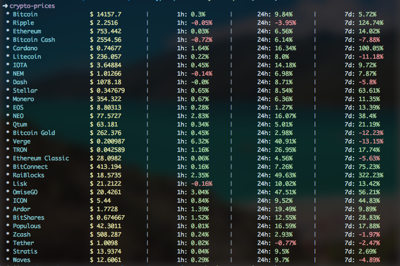

# Coin Prices

> Get price of the most popular crypto coins on CoinMarketCap



### Installing

```
$ npm install -g crypto-prices
```

### How to use

```sh
$ crypto-prices --help

  Usage: crypto-prices [options]

  Get crypto prices to any currency defined.

  Options:

    -c, --currency <currency>  Currency to be fetched.
    -l, --limit <limit>        How many coins to be returned.
    -h, --help                 output usage information
```

Listing 30 most popular coins

```sh
$ crypto-prices
```

Fetching bitcoin price

```sh
$ crypto-prices -c bitcoin
 * Bitcoin  	 	 $ 14117.3 	 | 	  1h: -0.9% 	 | 	 24h: 10.4% 	 | 	  7d: 5.72%
```

## License

This project is licensed under the MIT License - see the [LICENSE.md](LICENSE.md) file for details